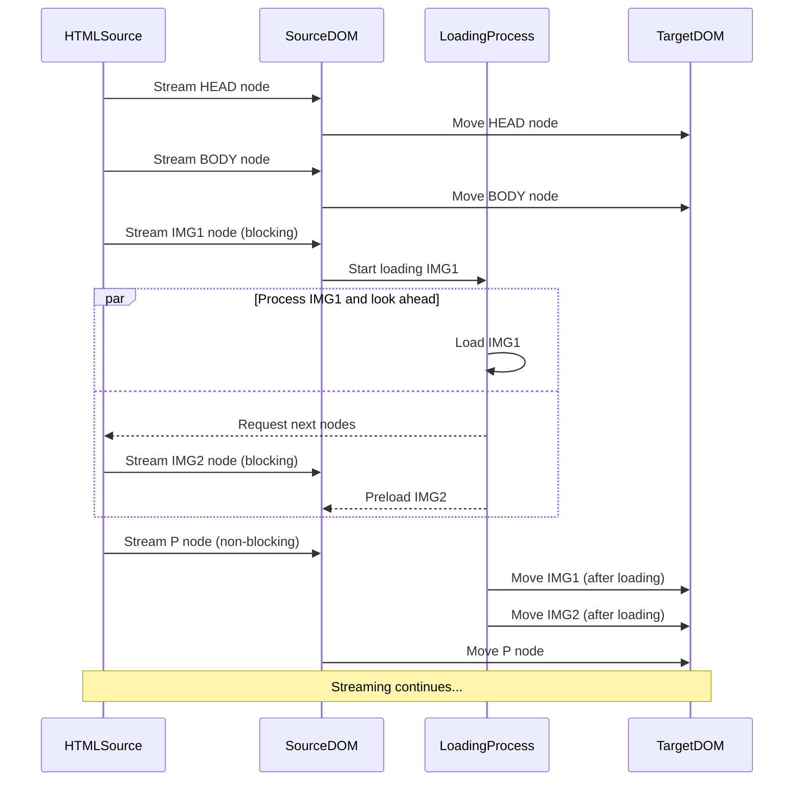

# pipeable-dom

An HTML parser and JSX runtime allowing for HTML to be streamed into a live DOM.

Sizes:

- `pipeable-dom` - 
- `pipeable-dom/jsx` - 
- `pipeable-dom` + `pipeable-dom/jsx` - 

## `DOMStream`

A `TransformStream<string, Node>` that implements lookahead preloading and browser document request rendering semantics.

This is a derivative of [@MarkdoDevTeam](https://x.com/MarkoDevTeam)'s [writable-dom](https://github.com/marko-js/writable-dom).

## `import "jsx"`

A stateless JSX runtime that renders to an async HTML stream.

It supports:

the react-jsx runtime

- sync and async functional components
- sync and async generator components
- there is no event / callback system, therefor
  - callbacks such as onclick accept strings and render the JS in the attribute

### `swap(target: Element, swap: SwapType, newContent: JSXNode):  Promise<void>`

A function to update the DOM using the JSX runtime as the template.

#### `SwapType`

Swap type is inspired by the [`hx-swap`](https://htmx.org/attributes/hx-swap/) attribute from [HTMX](https://htmx.org/).

Allowed values:

- `beforebegin` - Place the new content before the existing node
- `afterbegin` - Place the new content as the first item in the existing node
- `beforeend` - Place the new content as the last item in the existing node
- `afterend` - Place the new content after the existing node
- `outerHTML` - Replace the existing node
- `innerHTML` - Replace the existing node content
